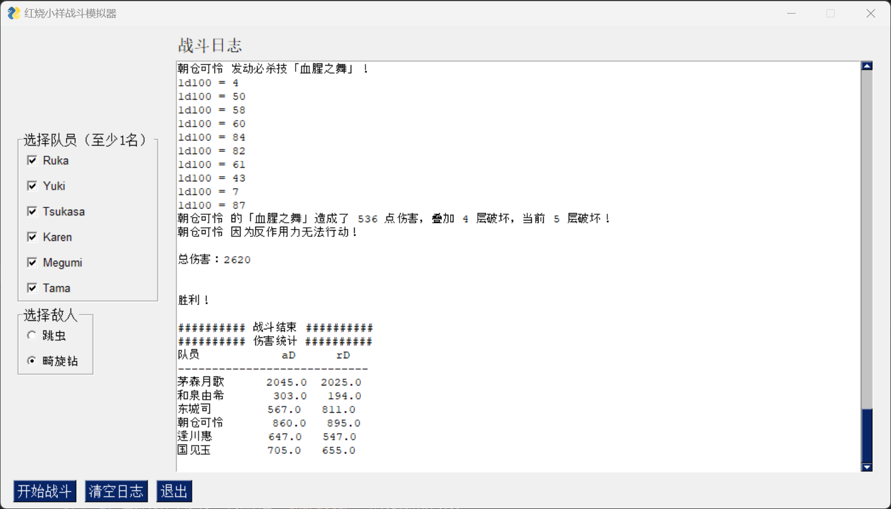

# 红烧小祥战斗模拟器

[简体中文](./README.md) | [English](./README_en.md) | [日本語](./README_ja.md)

---

## 介绍

本模拟器是基于多多良柴犬老师在NGA连载的安科作品[《[安科/安价] [同人] [MYGO] [HBR/炽焰天穹]丰川祥子、为了人类的未来而战……真的能战吗？》](https://nga.178.com/read.php?tid=41989465&_ff=784)编写的战斗模拟器。

## 安装

1. 下载本项目代码
2. 安装依赖：`pip install -r requirements.txt`
3. 运行模拟器：`python gui_main.py`

Windows 用户可以直接从 [Releases](https://github.com/fbhou/HBRTGWSimulator/releases) 下载可执行文件。

## 使用

1. 在程序左侧勾选想要加入战斗的 **队员**。
2. 在程序左侧选择本次战斗的 **敌人**。
3. 点击 **“开始战斗”** 按钮启动模拟。
4. 在右侧的“战斗日志”区域查看详细的战斗过程和最终的伤害统计。
5. 点击 **“清空日志”** 按钮可以清除日志区域的内容。

## 功能特性

- **图形用户界面**：提供基于 `FreeSimpleGUI` 的可视化操作界面，无需命令行基础。
- **动态角色选择**：自动从 `characters` 文件夹加载可选角色，方便扩展。
- **实时战斗日志**：在界面中实时输出详细的战斗流程、掷骰结果和最终统计。
- **格式化统计输出**：战斗结束后提供伤害统计表格，方便孤僻们进行强度辩经。

## 贡献

欢迎对本项目进行贡献！最简单的贡献方式是添加新的角色。

### 如何添加新角色

1. 在 `characters` 文件夹中，参考现有的角色文件（如 `ruka.py`, `tama.py` 等）创建一个新的角色Python文件。
2. 在新文件中定义一个继承自 `Character` 基类的新角色类。
3. 实现该角色的各项属性和技能逻辑。
4. 完成以上步骤后，重新运行 `gui_main.py`，新角色将自动出现在队员选择列表中，无需修改任何其他代码。

## 许可证

本项目采用 [MIT](LICENSE) 许可证。
