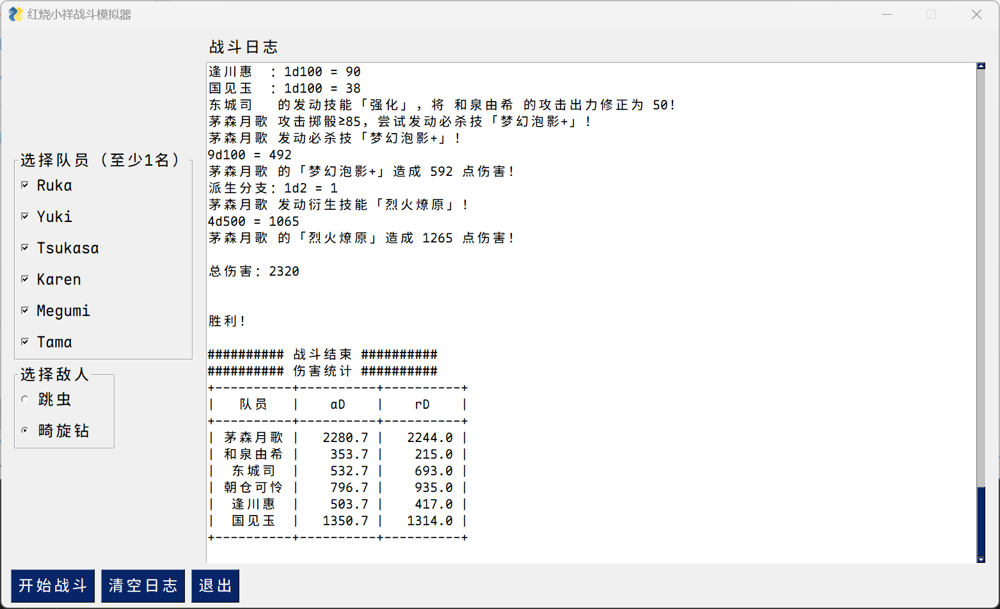

# HBR-TGW Combat Simulator

[简体中文](./README.md) | [English](./README_en.md) | [日本語](./README_ja.md)

---

## Introduction

This simulator is based on the Anke (TRPG-style story) work "[安科/安价] [同人] [MYGO] [HBR/炽焰天穹]丰川祥子、为了人类的未来而战……真的能战吗？" by NGA user "奈良良柴犬".
[Link to original story (in Chinese)](https://nga.178.com/read.php?tid=41989465)

## Installation

1. Clone or download this repository.
2. Install dependencies: `pip install -r requirements.txt`
3. Run the simulator: `python gui_main.py`

Windows users can directly download the executable file from the [Releases](https://github.com/fbhou/HBRTGWSimulator/releases) page.

## Usage

1. In the left panel, check the **squad members** you want to include in the battle.
2. In the left panel, select the **enemy** for this battle.
3. Click the **"Start Battle"** button to begin the simulation.
4. View the detailed battle process and final damage statistics in the "Battle Log" area on the right.
5. Click the **"Clear Log"** button to clear the content of the battle log.

## Features

- **Graphical User Interface**: A visual interface powered by `FreeSimpleGUI`, no command-line skills required.
- **Dynamic Character Selection**: Automatically loads selectable characters from the `characters` folder, making it easy to extend.
- **Real-time Battle Log**: Outputs a detailed flow of the battle, dice rolls, and final results in real-time within the interface.
- **Formatted Statistics Output**: Provides a formatted damage statistics table after the battle, convenient for theorycrafting and debating character strengths.

## Contributing

Contributions to this project are welcome! The easiest way to contribute is by adding new characters.

### How to Add a New Character

1. In the `characters` folder, create a new character Python file by referencing existing files (e.g., `ruka.py`, `tama.py`).
2. In the new file, define a new character class that inherits from the base `Character` class.
3. Implement the character's attributes and skill logic.
4. After completing these steps, restart `gui_main.py`, and the new character will automatically appear in the character selection list without any further code changes.

## License

This project is licensed under the [MIT](LICENSE) License.
